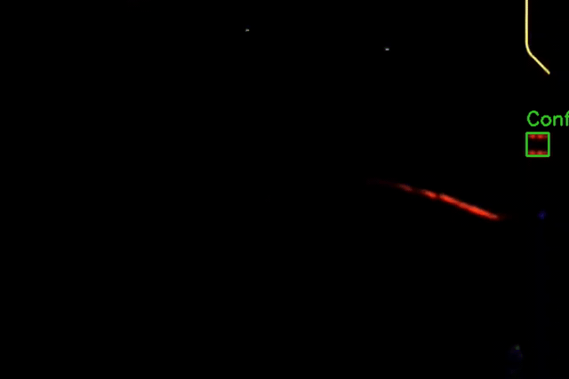
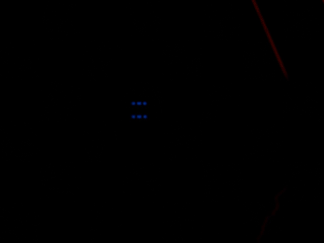
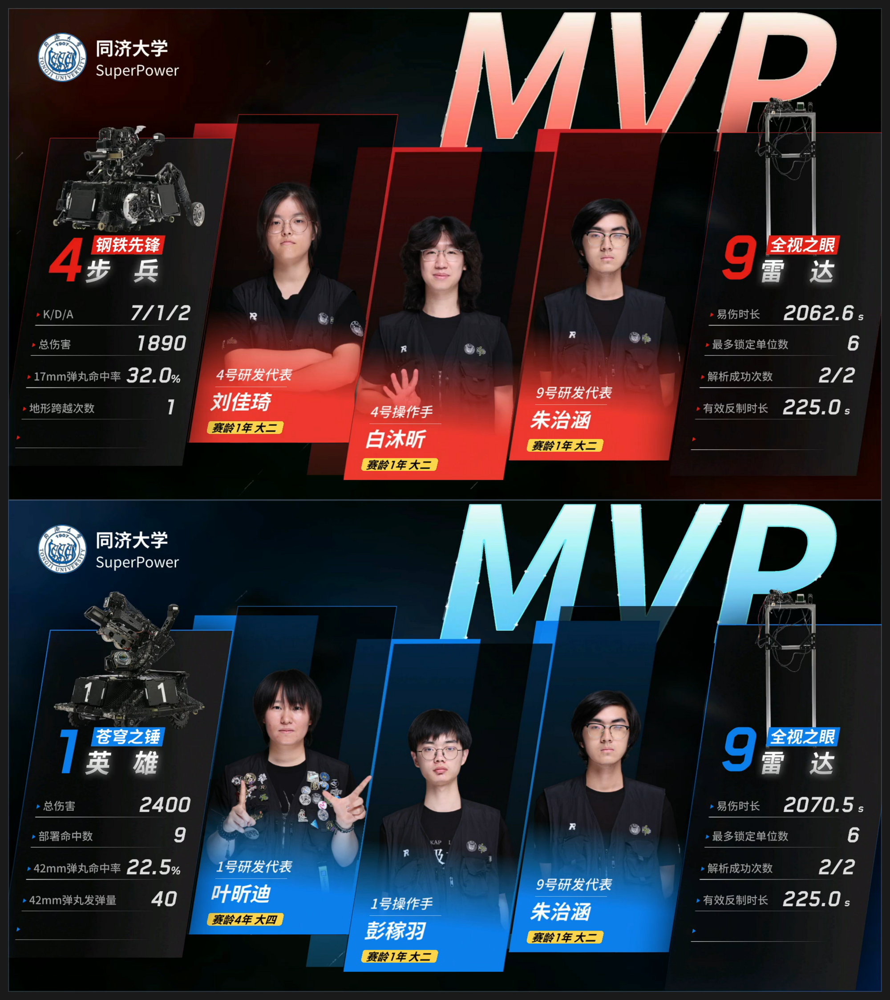
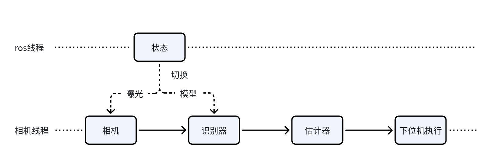
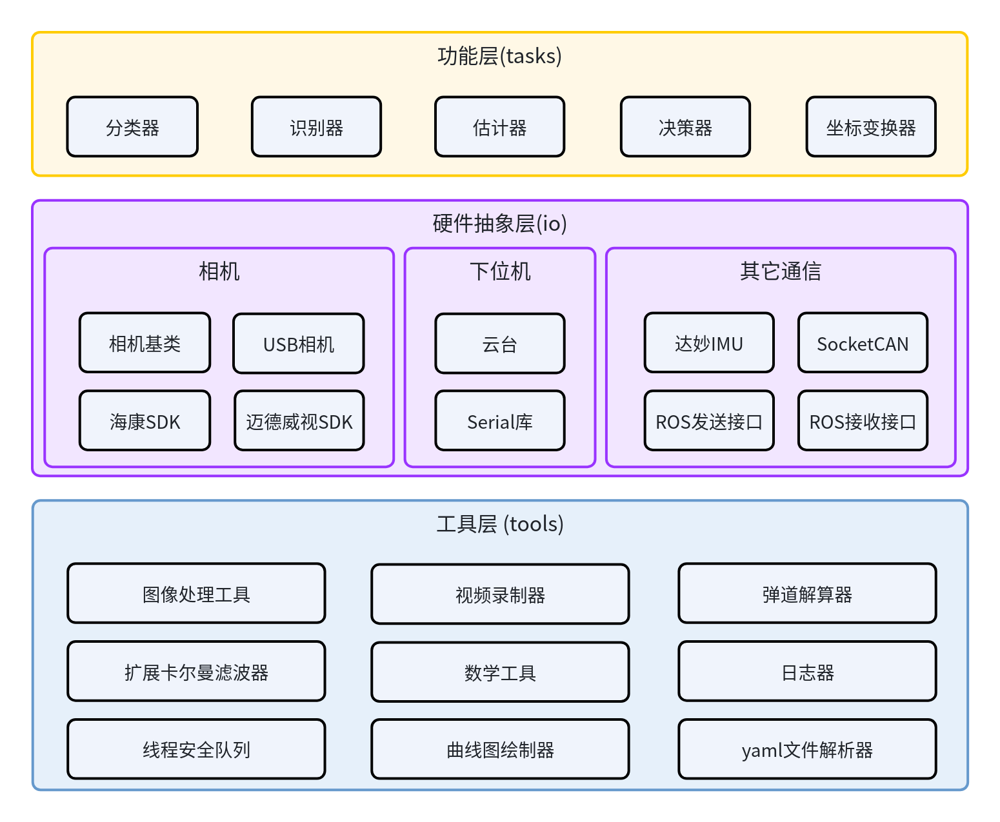
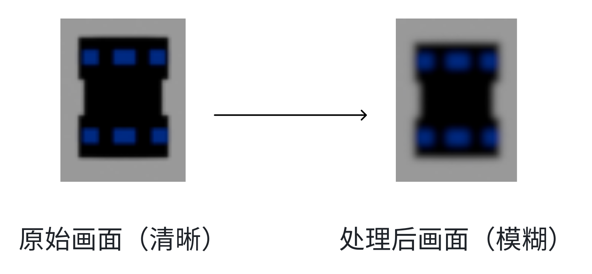

# 开源README

# 功能介绍

本项目主要用于26赛季雷达反制无人机，主要包括如下特点：

1. **数据集的自动生成：** 由Blender批量渲染生成数据集，进行YOLO模型的训练，降低数据集标注的人力资源消耗。

2. **三维定位：** 利用相似三角与相机内参估计目标相对位置（小孔成像原理），并求解不共轴激光的瞄准点。

3. **EKF跟踪与延时补偿：** 对yaw/pitch及其角速度做扩展卡尔曼滤波，并对计算延时、执行延时做前馈预测。

4. **1、2级反制与3级反制的切换：** 订阅ROS话题`/game_status`（来自于与裁判系统的通信，可以根据实际情况修改），通过比赛剩余时间切换曝光与YOLO模型，以实现从1、2级反制到3级反制的切换，可以根据战术灵活地控制3级反制的触发时间。

5. **激光与相机的外参调整：** 支持键盘交互式调整激光方向外参，可保存/回退，便于在时间或环境不满足精标外参的时候对外参进行临时调整。

6. **可视化与录制：** UDP JSON绘图（Plotter）与 视频\+四元数 录制（Recorder），便于复现问题与定量分析。

# 效果展示

**稳定的1\-2级反制**。在国赛的10场，共计27小局的比赛过程中，我们达成了前两级难度的稳定反制。由于我们采用了极低的曝光，使得我们的程序具有极强的鲁棒性，识别与跟随不受背景、运动模糊等原因干扰，做到了上场即稳定的效果。



**节省人力资源的数据集制作**。在识别方面，我们仍然采用YOLO算法，YOLO模型需要大量的数据集用于训练，我们并没有选择传统方式手动采集并标注，而是选择使用Blender进行建模并批量生成数据集，这大大减少了算法开发过程中的人力资源消耗。



**量化指标**。如下图所示，在26赛季全国赛的赛场上，搭载本算法的雷达最高可以达到5次的反制次数，平均反制时间为153\.3，位列全国赛第7（除去表演赛队伍）。



# 详细信息

## 项目环境

|**类别**|**内容**|
|---|---|
|操作系统|Ubuntu 22\.04|
|语言|C\+\+17|
|构建|CMake ≥ 3\.10，ament\_cmake \(ROS 2\)|
|推理|TensorRT 8\.6\.1\.6，TensorRT\-YOLO|
|相机|HikRobot工业相机|
|依赖|CUDA、OpenCV、Eigen3、yaml\-cpp、nlohmann\-json、fmt、spdlog|
|通信|串口（云台 / DM\-IMU）、SocketCAN（电控）、UDP（Plotter）|

## 编译方式及运行

1. 先克隆sp\_radar\_26，再克隆本仓库，放在sp\_radar\_26/src/目录下（因为编译需要sp\_radar\_26的自定义消息包）

2. 安装依赖：

    - 鱼香ros一键安装ros2`wget ``http://fishros.com/install`` -O fishros && . fishros`

    - NVIDIA驱动\(\>=525\)、[CUDA Toolkit\(12\.0\)\(runfile安装\)](https://developer.nvidia.com/cuda-12-0-0-download-archive?target_os=Linux&target_arch=x86_64&Distribution=Ubuntu&target_version=22.04&target_type=runfile_local)、[cudnn（8\.9\.7）（deb安装）](https://developer.nvidia.com/rdp/cudnn-archive)、[tensorrt（8\.6\.1）\(tar安装\)](https://developer.nvidia.com/downloads/compute/machine-learning/tensorrt/secure/8.6.1/tars/TensorRT-8.6.1.6.Linux.x86_64-gnu.cuda-12.0.tar.gz)

    - OpenCV、Eigen3、yaml\-cpp、nlohmann\-json、fmt、spdlog。

    - 克隆[TensorRT\-YOLO](https://github.com/laugh12321/TensorRT-YOLO)到目录`~/`（即/home/\<user\_name\>/）下，编译

    - 创建和配置虚拟环境，具体参考[trtyolo-export](https://github.com/laugh12321/TensorRT-YOLO/tree/export)
    ```
    conda create --name trtyolo python=3.8
    conda activate trtyolo
    pip install trtyolo-export
    ```

3. 模型准备 

    需要两次，第二遍把 ```antidronev5```换成```level_3_v5```
    - 将pt文件转为onnx文件
    ```
    cd models
    trtyolo export -w antidronev5.pt -v ultralytics -o ignore --max_boxes 100 --iou_thres 0.45 --conf_thres 0.25     
    ```
   - 将onnx文件转为engine文件
    ```
    cd models
    # 请将下面的路径替换为您的TensorRT实际安装路径
    /path/to/your/TensorRT-8.x.x.x/bin/trtexec --onnx=ignore/antidronev5.onnx --saveEngine=ignore/antidronev5.engine --fp16 
    ```

4. 编译

```Plain Text
cd /your/path/to/sp_radar_26
colcon build --packages-select radar_msgs
colcon build --packages-select sp_antidrone_26
```

5. 运行：

```Bash
# 相机模式
sudo chmod 666 /dev/gimbal
source install/setup.bash
cd src/sp_antidrone_26
ros2 run sp_antidrone_26 antidrone

# 离线视频模式
ros2 run sp_antidrone_26 antidrone video <video_path>
```

## 数据流图

我们的程序分为两个线程，一个是相机线程，用于不间断采集相机图片并识别目标模块，如果识别成功，则解算相应的位姿发送给下位机执行，另一个是ros线程，用于监听裁判系统的ros节点发送的消息，比赛开始时为1\-2级难度模式，如果时间剩余4分钟，则切换为3级难度反制，包括调高曝光、识别器切换为3级反制模型。


## 软件架构

本项目在sp\_vision\_25的基础上发展而来，所以软件架构基本相似，只是由于本代码只有雷达反制需要使用，所以我们删去了顶层的应用层。在硬件抽象层和工具层，我们并未做大的更改。而在功能层，我们根据开发过程中的需要，更改了识别器、坐标变换器等模块。


## 文件结构

```Plain Text
sp_antidrone_26/
├── CMakeLists.txt              # 顶层构建脚本（ament_cmake）
├── package.xml                 # ROS 2 包描述
├── README.md
├── config/
│   └── antidrone.yaml          # 主配置：模型、相机、激光、云台、EKF 参数
├── include/                    # 核心类声明
│   ├── antidrone_node.hpp      # ROS 节点 + 相机处理线程
│   ├── detector.hpp            # 检测器基类/YOLO/灯条/工厂
│   ├── solver.hpp              # 相机→云台→世界坐标解算
│   ├── tracker.hpp             # EKF 跟踪器
│   └── target.hpp              # UAVTarget 数据结构
├── src/
│   ├── main.cpp                # 入口：camera / video 两种模式
│   ├── antidrone_node.cpp      # 主循环、level-3 切换、键盘标定
│   ├── tracker.cpp             # EKF 实现与延时补偿
│   └── detectors/
│       ├── base_detector.cpp   # 位姿估计、激光瞄准点、标定
│       ├── yolo_detector.cpp   # TensorRT-YOLO 检测
│       ├── light_bar_detector.cpp # 灯条对检测
│       └── detector.cpp        # 检测器工厂
├── tools/                      # 通用算法库
│   ├── extended_kalman_filter.*
│   ├── trajectory.*            # 弹道解算（含空气阻力）
│   ├── ransac_sine_fitter.*    # RANSAC 正弦拟合
│   ├── pid.* / crc.* / math_tools.* / img_tools.*
│   ├── plotter.*               # UDP JSON 可视化
│   ├── recorder.*              # 视频 + 四元数录制
│   └── camera2gimbal.*         # 相机↔云台坐标/角度工具
├── io/                         # 外设与通信层
│   ├── camera.*                # 相机抽象
│   ├── gimbal/                 # 云台串口通信
│   ├── hikrobot/ mindvision/ usbcamera/  # 相机 SDK 封装
│   ├── cboard.* socketcan.*    # 电控 CAN 通信
│   ├── dm_imu/                 # DM 惯性测量单元
│   ├── ros2/                   # ROS2 发布/订阅
│   ├── serial/                 # 跨平台串口库
│   └── configs/camera.yaml     # 相机/电控标定配置
└── shfiles/main.sh             # 启动脚本
```

# 数据集的渲染生成

我们采用YOLO进行激光检测模块的识别，该模块与大部分yolo识别的对象相比，它的特点是外观尺寸严格一致，所以可以采用建模的方式进行数据集的制作。

Blender 文件存放在 `render` 文件夹中，建议使用 Blender 5\.2\.0 版本打开。我们选择的标注对象为视觉特征模块。

## 建模与渲染

由于相机曝光值设置极低，实际拍摄画面中，激光检测模块仅有发光部分保留原有颜色（红/蓝/紫），其余区域则完全呈现为黑色。为在渲染中还原这一效果，我们在建模时为发光部分赋予对应的颜色自发光（Emission）材质，其他部分则使用黑色自发光材质，从而使渲染结果在色彩表现上与真实拍摄基本一致。

此外，现实成像质量常受对焦不准、光晕等因素影响而产生模糊效果，而渲染过程本身是理想的。因此，我们在渲染管线中加入了辉光（Bloom）和高斯模糊（Gaussian   Blur）两项后处理效果。辉光使画面中亮度较高的区域（即视觉特征模块）产生光晕，通过扩散高亮像素并使其柔和地融入周围较暗区域，模拟高曝光下的光晕现象；高斯模糊则模拟相机镜头的光圈虚化效果，使焦点清晰、焦外模糊，在一定程度上缓解因对焦不准导致的识别困难。


## 增强鲁棒性的方法

在初步使用上述方法生成数据集并训练模型后，我们发现模型的召回率较高，但精确率偏低，容易出现误识别。考虑到所用镜头焦距较大、视场角（FOV）较小，模型容易聚焦到干扰目标上。为解决此问题，我们引入了  2025 赛季定位程序的相机内录视频，通过调节亮度、对比度等参数后动态播放并平移，为数据集提供了真实的负样本，显著减少了误识别情况。

在现实场景中，激光检测模块相对于相机的方向和角度会持续变化。为此，我们制作了动画，使模块绕垂直于水平面的中心轴旋转，并绕相机光轴进行小幅摆动，模拟无人机在左右加速时模块产生的倾斜状态。同时，在渲染脚本中我们随机平移物体位置，以增加数据的多样性。

在实际测试中，我们发现模型对远处清晰目标的识别效果良好，但在近距离情况下，因成像过于模糊，识别置信度容易低于阈值。为此，我们手动标注了约 100 张图像，并与渲染生成的约 6000 张数据集合并训练，最终训练出的模型在远近场景下均能稳定识别。

综上，我们使用极小的人力成本，最终训练得到具有良好泛化能力的识别模型。

# 不共轴相机与激光笔

相机光轴与激光笔不共轴：激光在相机坐标系下存在平移偏移 $\mathbf{S}_0$ （`laser_offset`）与方向 $\mathbf{d}_0$ （`laser_direction`），无法直接用相机光心射线近似。

## 数学模型

**位姿估计（相似三角形）：** 设相机内参 $f_x, f_y, c_x, c_y$ ，目标真实尺寸 $H_{real}$ ，像素高度 $h_{pixel}$ ，则：

$$
z = \frac{f_y \cdot H_{real}}{h_{pixel}}, \quad
x = \frac{(u - c_x)\, z}{f_x}, \quad
y = \frac{(v - c_y)\, z}{f_y}
$$

得到目标在相机坐标系的坐标 $\mathbf{p}_{cam}$ 。

**激光瞄准点求解：** 目标绕云台旋转 $\mathbf{R}$ 后应该落在激光射线上，约束为：

$$\mathbf{R}(a, t)^{T}\,\mathbf{p}_{cam} \;=\; \mathbf{S}_0 + \lambda\,\mathbf{d}_0$$

两侧对 $\mathbf{d}_0$ 做叉乘消去 $\lambda$ ，得到二维残差：

$$\mathbf{r}(a, t) = \left[\left(\mathbf{R}(a,t)^{T}\,\mathbf{p}_{cam} - \mathbf{S}_0\right) \times \mathbf{d}_0\right]_{1:2}$$

其中旋转用轴角参数化 $\mathbf{R}(a,t)=\mathrm{Rot}(t,\;[\cos a,\ \sin a,\ 0]^T)$ 。代码中采用【多初值种子\+牛顿迭代\+Armijo回溯线搜索】求解 $(a, t)$ ，并加入距离自适应的角度容差校验；求解失败时退化为小角度近似。最终瞄准方向为 $\mathbf{R}\,\mathbf{e}_z$ ，瞄准点为该方向乘以目标距离。

## 外参的标定、粗调与精调

**程序化标定：** 用圆点标定板在多距离/多位姿下自动采样激光落点的3D坐标，拟合成相机系下的激光直线，直接解出偏移和方向：

- 标定板平面求解：`cv2.findCirclesGrid`检测圆点网格（ $7\times10$ 、间距 $40\ \mathrm{mm}$ ），`cv2.solvePnP`求标定板在相机系下的平面方程，得法向量 $\mathbf{n}_c$ 与常量 $d_c$ （满足 $\mathbf{n}_c^T\mathbf{x}+d_c=0$ ）。

- 激光点定位：HSV阈值提取红色激光点质心（或手动点击标记），得像素坐标 $\mathbf{u}=(u,v,1)^T$ 。

- 射线\-平面求交：反投影射线 $\mathbf{r}=K^{-1}\mathbf{u}$ ，与标定板平面求交得3D激光点

$$\mathbf{S}_0 = \bar{\mathbf{p}} - \frac{\bar{p}_z}{d_{0,z}}\,\mathbf{d}_0$$

- 多距离采样：移动标定板，在多个距离/位姿重复1–3步，收集不少于9个3D激光点。

- SVD直线拟合：对去质心点集做 SVD，取主奇异向量为直线方向 $\mathbf{d}_0$ （必要时按 $d_{0,z}>0$ 规范化符号）；直线与 $z=0$ 平面的交点即偏移

$$\mathbf{S}_0 = \bar{\mathbf{p}} - \frac{\bar{p}_z}{d_{0,z}}\,\mathbf{d}_0$$

- 重投影验证：沿拟合直线按1–20m采样并`cv2.projectPoints`重投影回图像，与真实激光点对照校验误差。

拟合结果即为`laser_direction`（ $\mathbf{d}_0$ ）与`laser_offset`（ $\mathbf{S}_0$ ）

**粗调（键盘微调）：** 运行`antidrone camera`后按`a`进入标定模式，方向键微调激光方向（步长约 $2\times10^{-4}$ rad），`Enter`保存到`config/antidrone_calibrated.yaml`，`ESC`回退。

- 启动时会优先加载`antidrone_calibrated.yaml`覆盖原始标定，删除该文件即可重置。

**精调（双距离相似三角形标定）：** 人为测量短距离 $d_1$ （如15m）与长距离 $d_2$ （如28m）下，激光落点相对目标中心的实际偏差 $\delta_1$ 、 $\delta_2$ （单位 $\mathrm{m}$ ， $x$ 、 $y$ 各测一维）。设当前标定为偏移 $S$ 与方向角 $\theta$ （激光方向在 $x/y$ 平面内与光轴的夹角），则距离 $d$ 处的偏差由偏移项（不随距离变化）与方向项（随距离线性增长）叠加：

$$\delta(d) = S + d\tan\theta$$

由两次测量的偏差直线斜率 $\tan\theta=\dfrac{\delta_2-\delta_1}{d_2-d_1}$ 。为让短、长距离下激光落点都落在目标中心（使该直线归零），offset与direction需要同时加/减的修正量为：

$$
\Delta\theta = -\arctan\left(\frac{\delta_2-\delta_1}{d_2-d_1}\right),\qquad
\Delta S = -\delta_1 + d_1\,\frac{\delta_2-\delta_1}{d_2-d_1}
$$

$x$ 、 $y$ 方向分别计算（约定 $\delta>0$ 表示激光落点位于目标中心的正 $x/y$ 侧）。将 $\theta\leftarrow\theta+\Delta\theta$ （据此更新方向向量 $\mathbf{d}_0$ ）、 $S\leftarrow S+\Delta S$ 写回配置即可完成精调。

# 未来优化方向

当前，数据集的仿真渲染工作主要覆盖了 1–2 级难度的自动生成。对于 3  级难度，由于视觉特征模块不具备自发光特性，相机成像质量高度依赖于外部光照环境，现有技术路线难以实现有效渲染。不过，若能在 Blender  中进一步完善外观建模、优化材质参数并合理布置光源，以更真实地还原赛场光照条件，则仍有实现 3 级难度数据生成的可能。

# 项目成员

朱治涵、王云杰

# 参考文献

[1] XiaoYoung. 【RM2025-自瞄算法开源】同济大学SuperPower战队[EB/OL]. RoboMaster论坛. https://bbs.robomaster.com/article/803315 2025.

[2] sirvir. 【RM2025-能量机关数据集】香港科技大学ENTERPRIZE战队能量机关仿真数据集研究[EB/OL]. RoboMaster论坛. https://bbs.robomaster.com/article/714430 2025.


